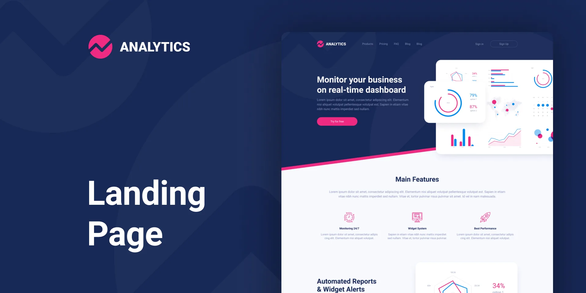

# Landing Page

This is a landing page from a [Figma design](https://www.figma.com/community/file/905814382591046401/analytics-landing-page-design) found in the [Figma Community](https://www.figma.com/community).

## Preview

You can see the landing page in action [here](https://analytics-landing-page-tr20.vercel.app/).

And you can get the Figma design file [here](https://www.figma.com/community/file/905814382591046401/analytics-landing-page-design).

## Notes

- The designer and developer has no relationship. I brought the design from the Figma community.

## Designer Info

The website was designed by **Valery Zanimanski**. You can find him on:

- [Figma](https://www.figma.com/@zanimanski)
- [Dribbble](https://dribbble.com/zanimanski)
- [Twitter](https://twitter.com/zanimanski)

## Developer Info

The website was developed by **Taib Rabah**. You can find him on:

- [GitHub](https://github.com/Taib-Rabah)
- [Telegram](https://t.me/y_o_5)

## Main tools used

- [Next.js](https://nextjs.org/) with [TypeScript](https://www.typescriptlang.org/)
- [Tailwind CSS](https://tailwindcss.com/)
- [SASS (SCSS Syntax)](https://sass-lang.com/)
- [Shadcn UI](https://shadcn.com/)
